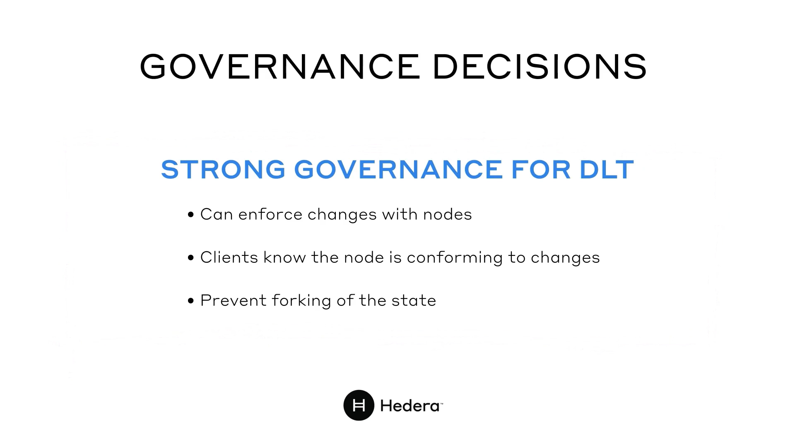
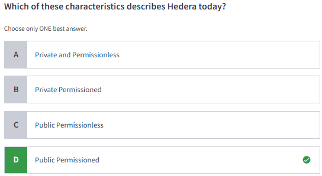
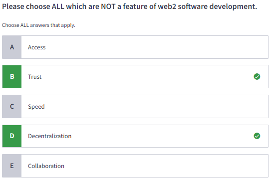

#### Certified Hedera Hashgraph Developer | M1: Introduction to Web3 and Hedera

# 1.1 The Advent of Decentralized Ledger Technology

# 1.2 Introduction to the Hedera Network

# 1.3 The Hedera Coverning Council

# 1.4 Network Growth

# 1.5 Quiz

