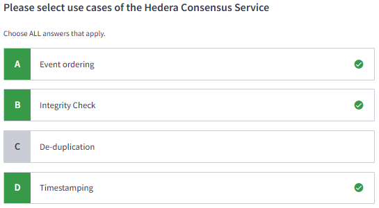

#### Certified Hedera Developer | M2: Hedera Network Architecture

# 2.1 Introduction to Networks

# 2.2 Introduction to Nodes

# 2.3 Consensus Node

# 2.4 Mirror Node API & Network Explorer

# 2.5 Mirror Node

# 2.6 Introduction to Hedera Services

# 2.7 Hedera Consensus Service

# 2.8 Hedera Token Service

# 2.9 Hedera Smart Contract Service

# 2.10 Lab 1: Set Up a TestNet Account
[Create a Testnet Accounts](https://docs.hedera.com/hedera/networks/testnet/testnet-access)
[Register Here](https://portal.hedera.com/register)
or use Lab.md

# 2.11 Quiz

