#### Certified Hedera Developer | M4: Hedera Developer Fundamentals

# 4.1 Introduction to Hedera SDKs
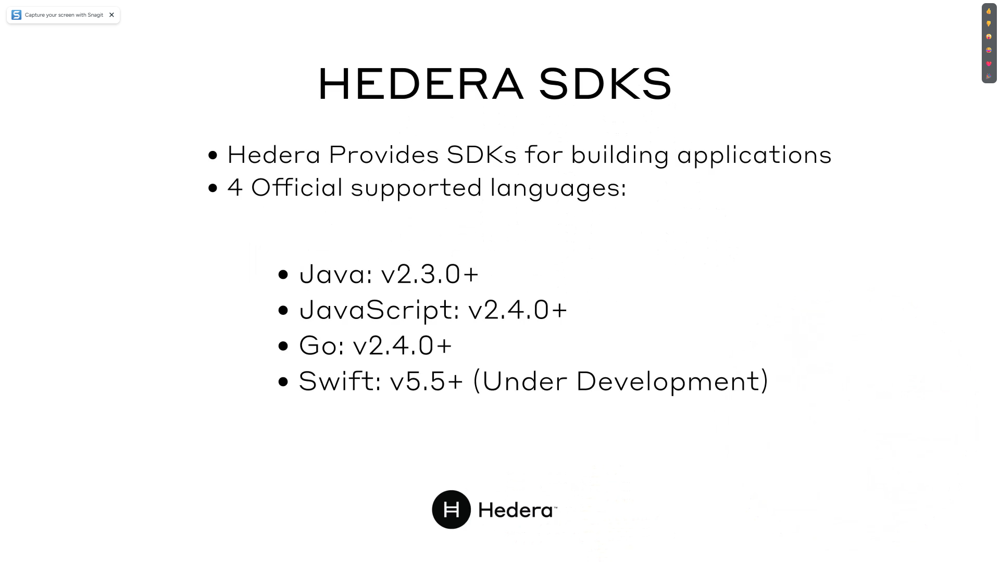
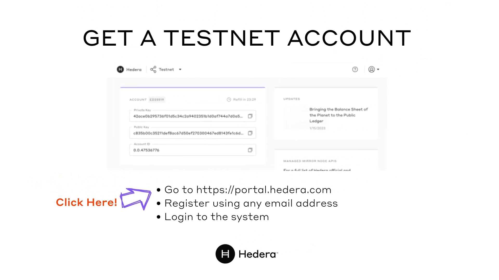
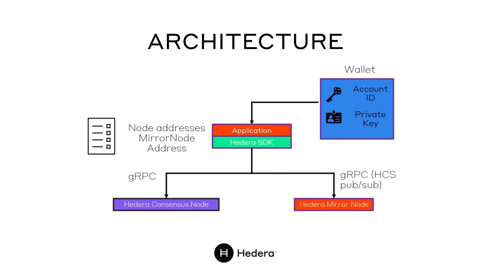
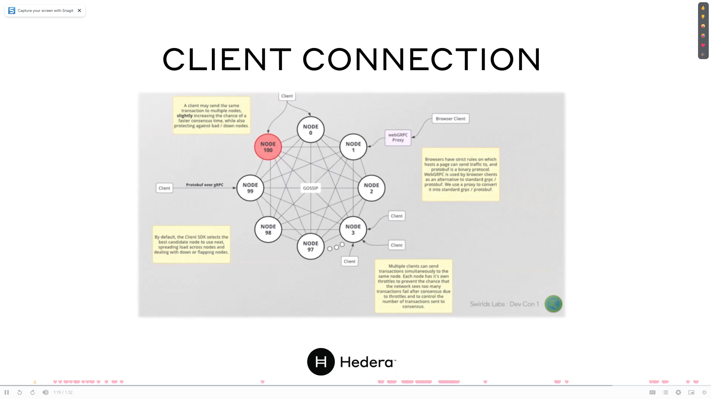

# 4.2 Lab 2: Environment Setup
[Environment Setup](https://docs.hedera.com/hedera/getting-started-sdk-developers/environment-setup)

# 4.3 Hedera Client
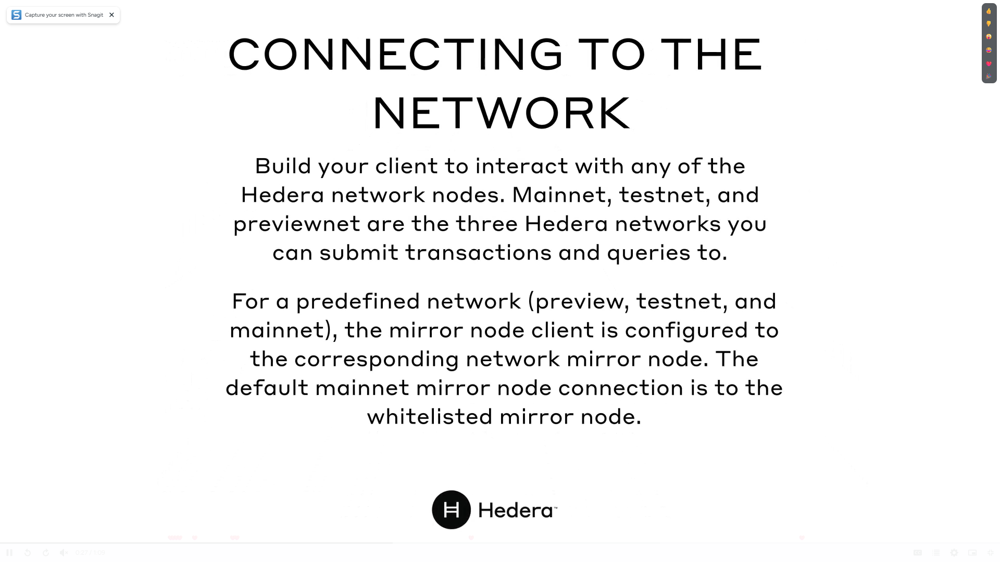
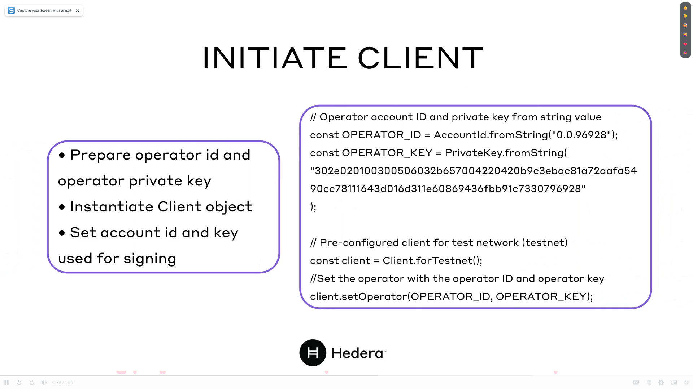

# 4.4 Hedera Account in Depth
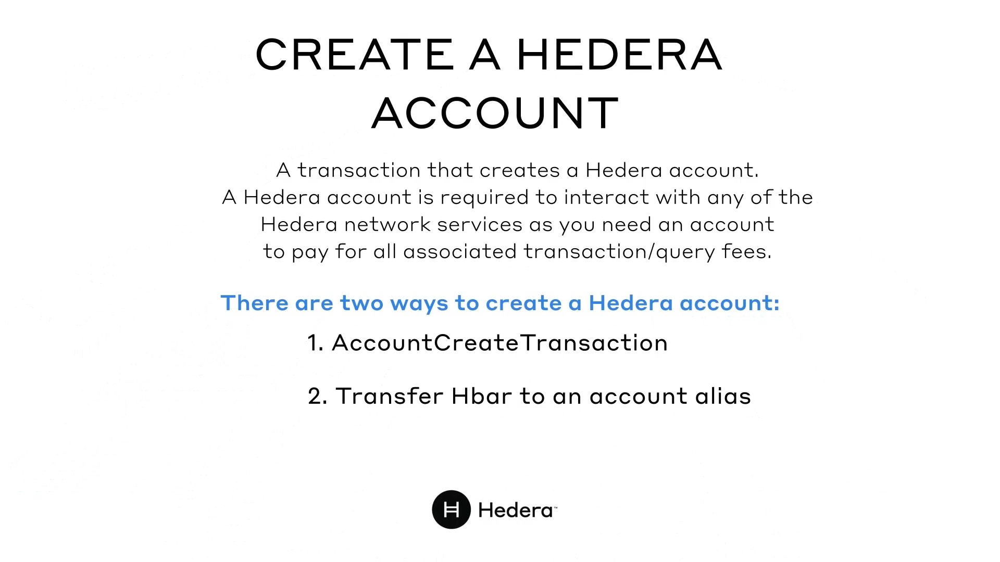
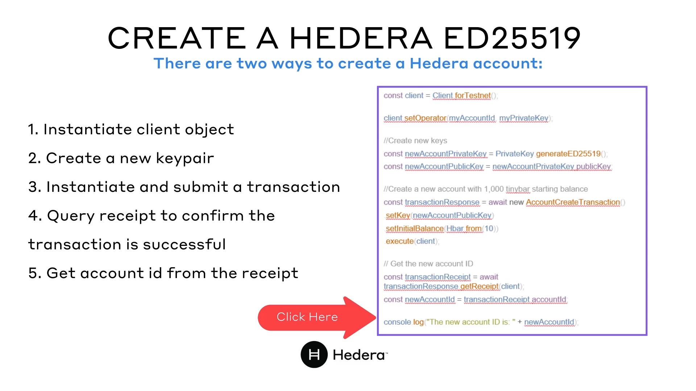
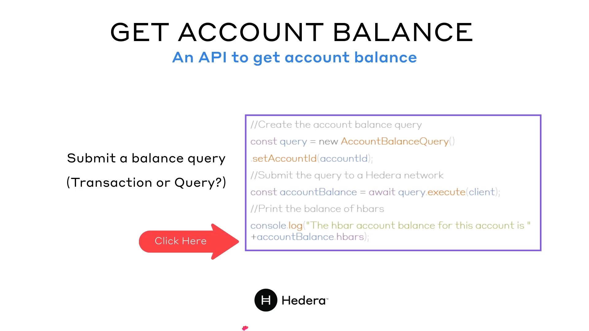
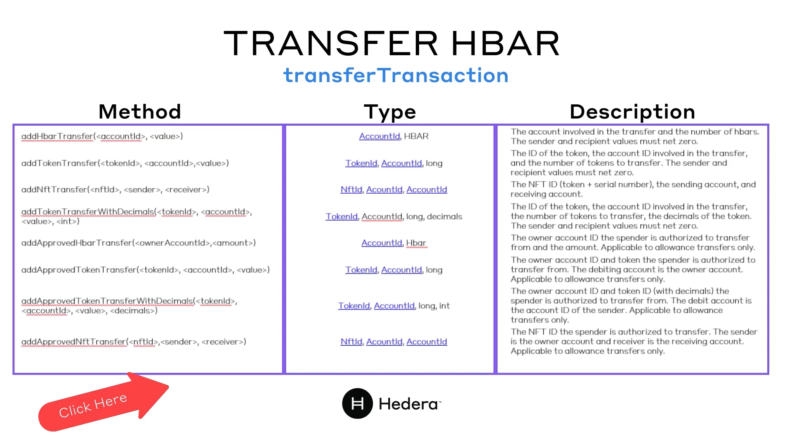
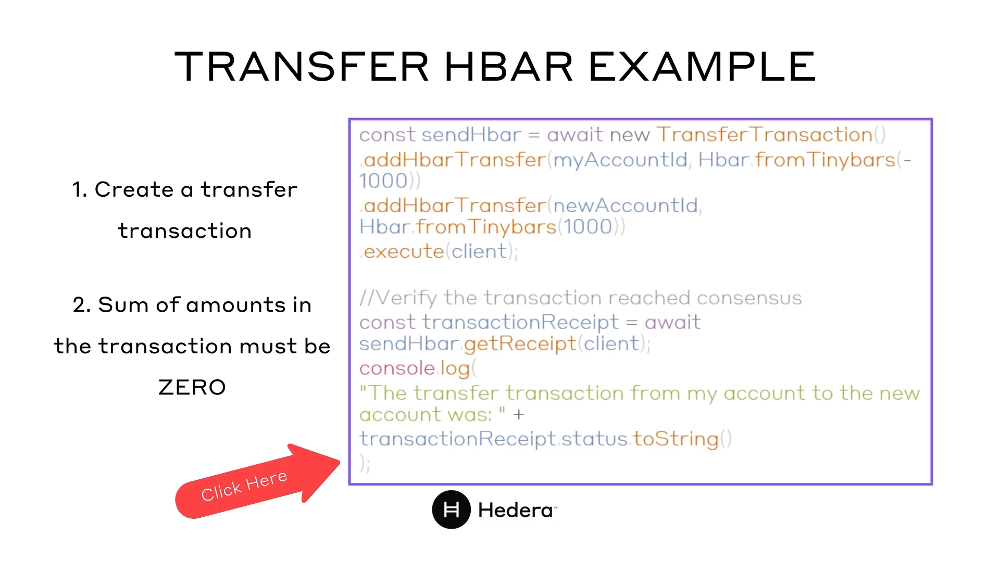
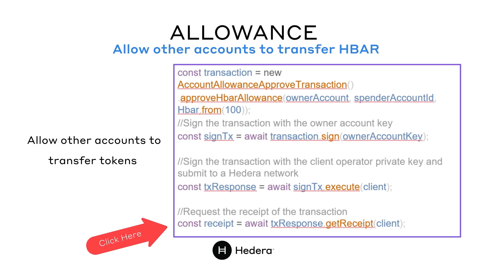

# 4.5 Lab 3: Create Account

# 4.6 Lab 4: Transfer HBAR and Query Ledger Data
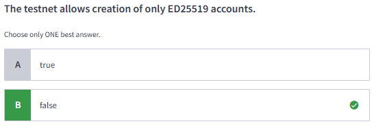

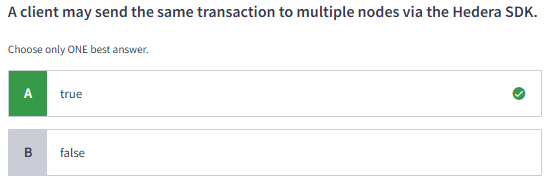
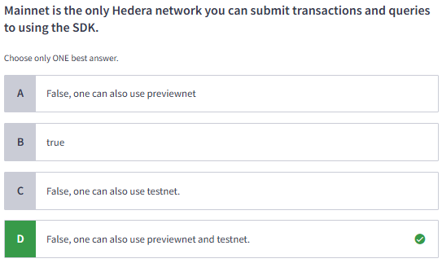
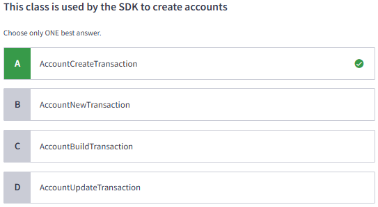

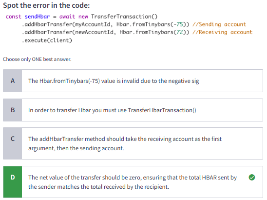
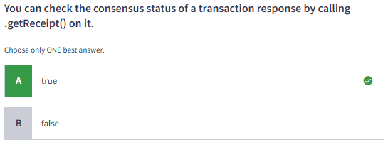
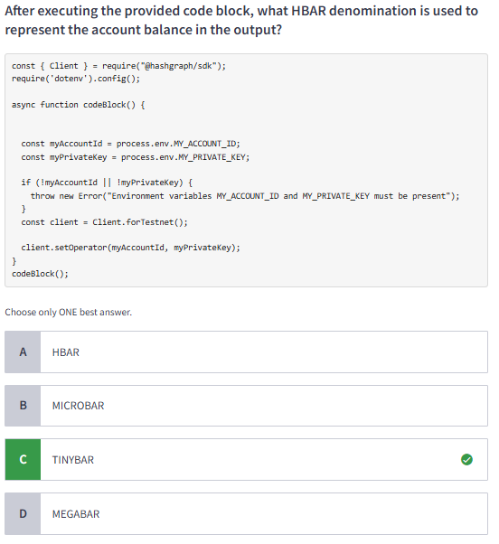

# 4.7 Quiz

