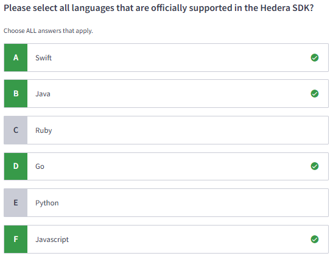
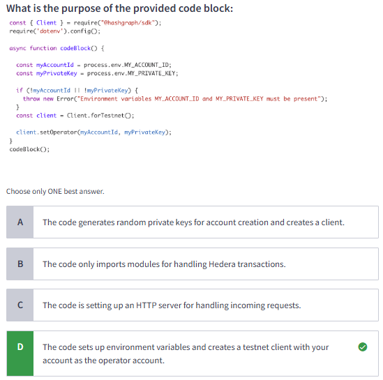

#### Certified Hedera Developer | M4: Hedera Developer Fundamentals

# 4.1 Introduction to Hedera SDKs

# 4.2 Lab 2: Environment Setup & Create Account
[Environment Setup](https://docs.hedera.com/hedera/getting-started-sdk-developers/environment-setup) or else use Lab.md

# 4.3 Hedera Client

# 4.4 Hedera Account in Depth

# 4.5 Lab 3: Transfer HBAR and Query Ledger Data
[video](https://www.youtube.com/watch?v=gsmRFqsNTQQ&list=PLjyCRcs63y80w30q5EsBDOBZ_B04p1Vgc&index=3&ab_channel=Hands-onDevRel)

# 4.6 Quiz

> While the Hedera testnet does support ED25519 accounts, it also supports ECDSA (specifically, ECDSA(secp256k1)) accounts as well.

> A client can send the same transaction to multiple Hedera nodes to increase the chances of successful transaction execution, especially if they are concerned about potential node unavailability or censorship. If a transaction is submitted to multiple nodes, the successful transaction and any duplicate transactions will be returned with the same transaction ID. 

> Note: "TINYBAR" refers to the testnet HBAR

> The "operator" account serves as the default account for submitting transactions and paying associated fees. It's essentially the account used to sign and execute operations on the network. The operator's private key is used to authorize transactions, and its account ID is used to generate default transaction IDs. 

