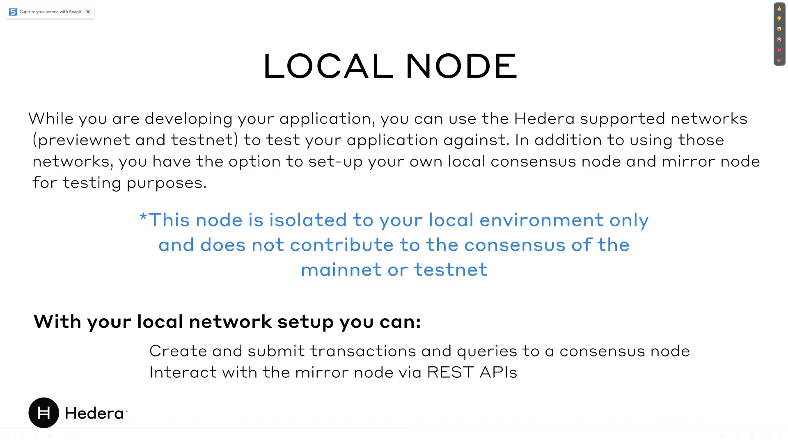
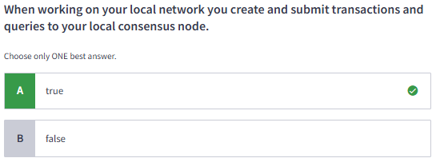
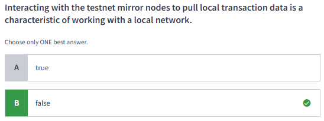
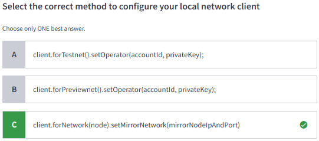
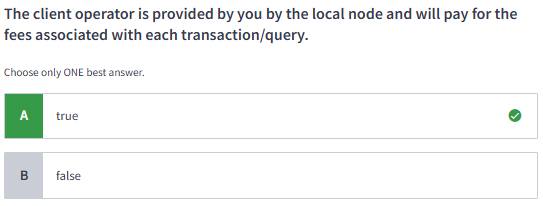

#### Certified Hedera Developer | M5: Local Network Setup

# 5.1 Setup Local Network

# 5.2 Lab 5: Local Network Setup
[Local Network Setup](https://github.com/hiero-ledger/hiero-local-node#docker)
[Blog Post Guide](https://hedera.com/blog/how-to-set-up-your-own-hedera-local-network-using-docker)
[Video Guide (have not confirmed if it is updated)](https://www.youtube.com/watch?v=KOhzu6ftmbY&ab_channel=Hedera)

# 5.3 Quiz

