#### Certified Hedera Hashgraph Developer | M7: Hedera Token Service - Fungible and Non Fungible Tokens

# 7.1 Hedera Token Service
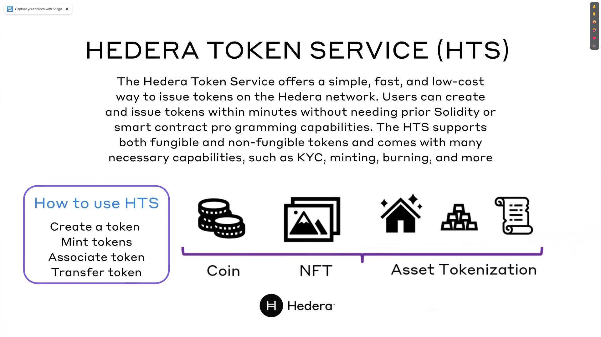
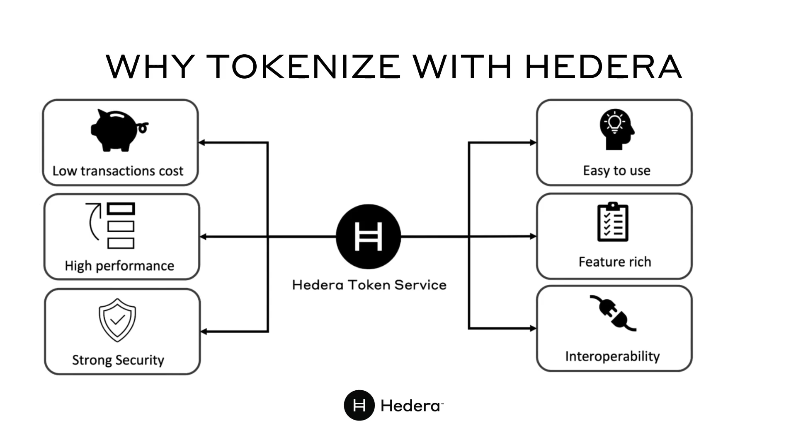

# 7.2 Lab 7A: Creating a Fungible Token
[Youtube Video](https://www.youtube.com/watch?v=xh3Nj3MVVMI&list=PLjyCRcs63y80w30q5EsBDOBZ_B04p1Vgc&index=4&ab_channel=Hands-onDevRel)
[Hedera Docs](https://docs.hedera.com/hedera/tutorials/token/create-and-transfer-your-first-fungible-token)

# 7.3 Lab 7B: Creating a Non-Fungible Token
[Hedera Docs](https://docs.hedera.com/hedera/tutorials/token/create-and-transfer-your-first-nft)

# 7.4 Quiz
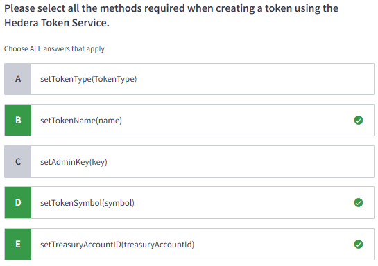
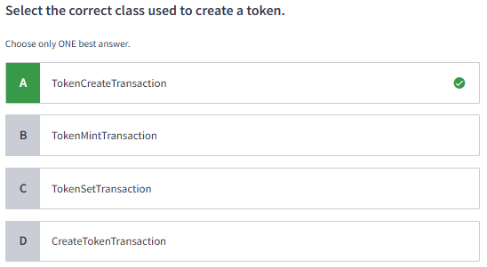
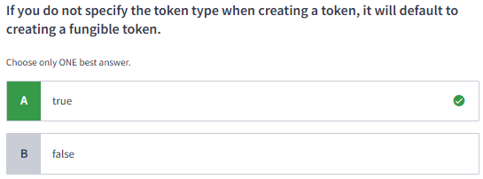
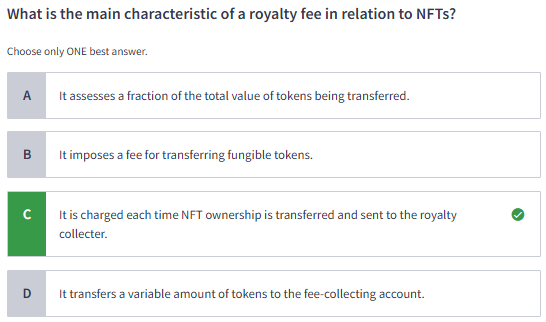
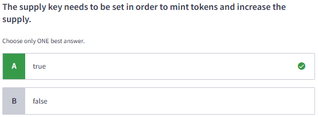
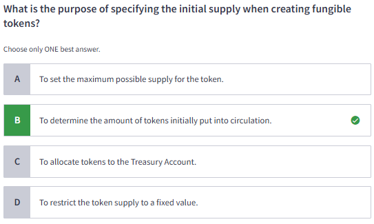
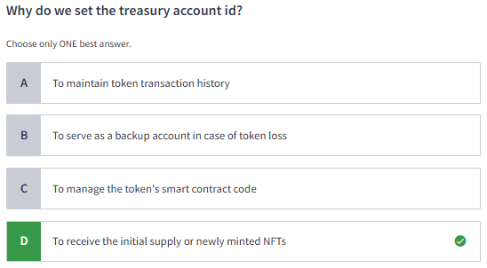
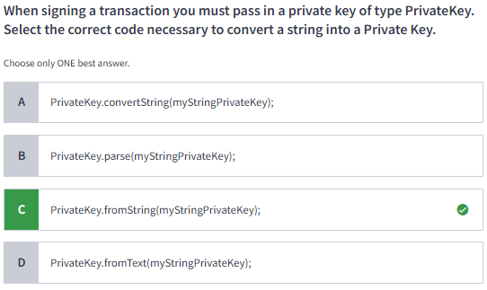
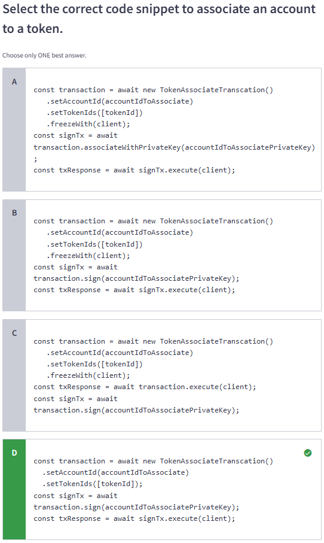
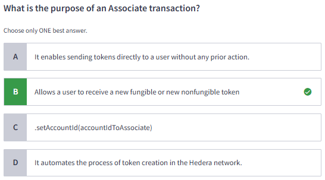
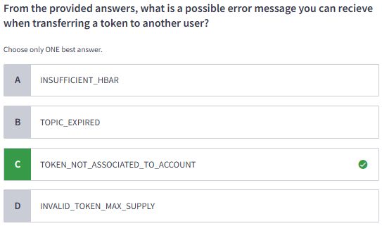
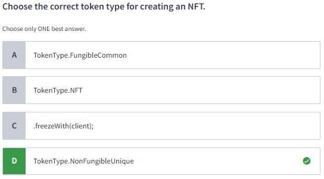
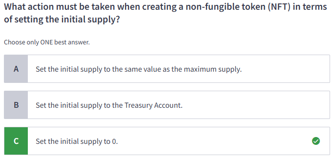
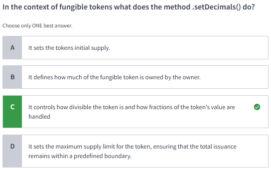
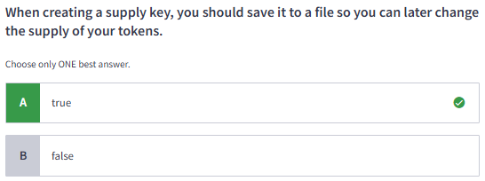
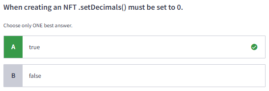
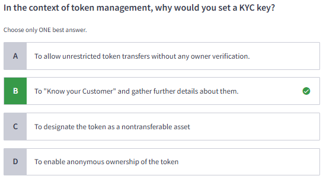
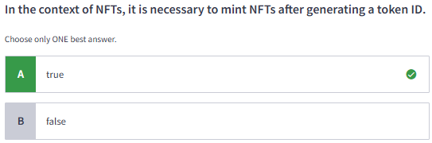
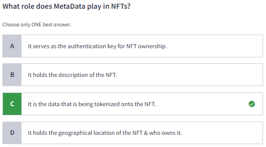
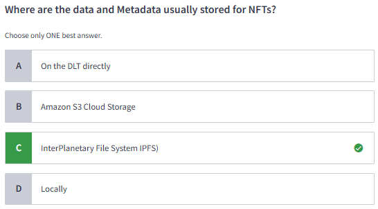
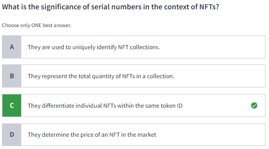