#### Certified Hashgraph Developer | M09: Hedera Smart Contract Service

# 9.1 Hedera Smart Contract Service
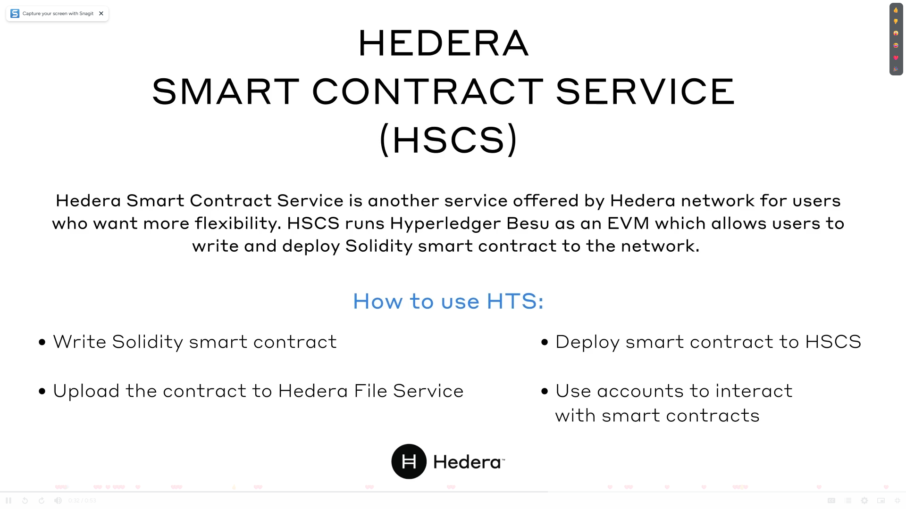
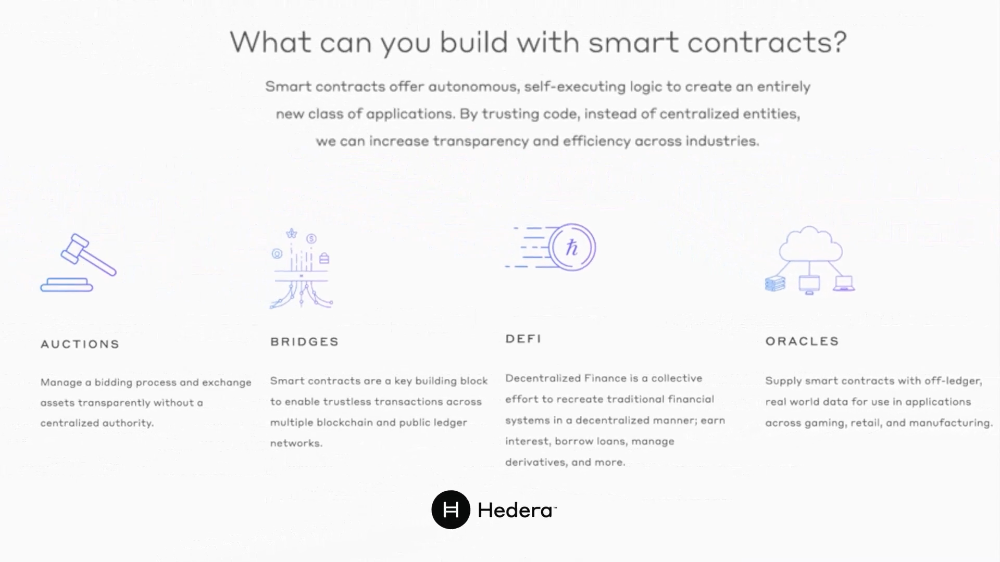

# 9.2 Interoperability
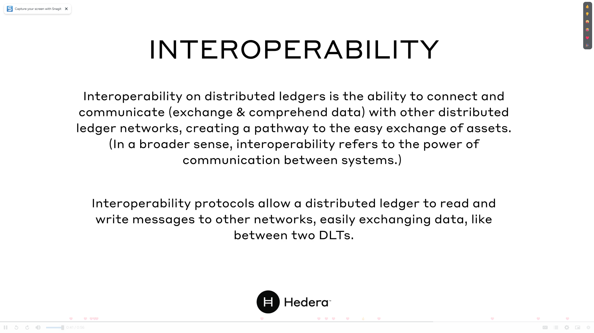

# 9.3 Lab 9A: Smart Contract Implmentation using Solidity
[Invalid Link](https://docs.hedera.com/hedera/tutorials/smart-contracts/deploy-your-first-smart-contract#1.-create-a-hello-hedera-smart-contract)
[Hedera Blog](https://hedera.com/blog/how-to-set-up-foundry-to-test-smart-contracts-on-hedera)
[Youtube Video](https://www.youtube.com/watch?v=OjAjVw5SKaA&list=PLjyCRcs63y80w30q5EsBDOBZ_B04p1Vgc&index=6&ab_channel=Hands-onDevRel)

# 09.4 Interoperability & NFT
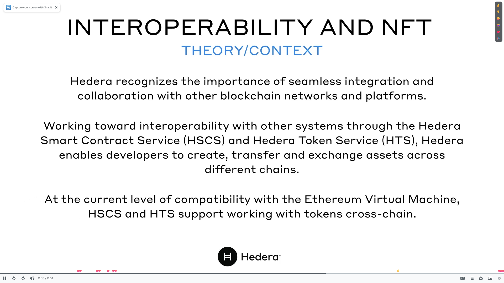

# 9.5 Lab 9B: Creating NFTs Using A Solidity Contract
[Hedera Tutorial](https://docs.hedera.com/hedera/tutorials/token/create-and-transfer-an-nft-using-a-solidity-contract)

# 9.6 Quiz
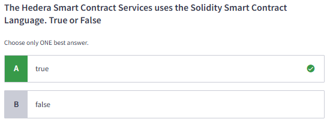
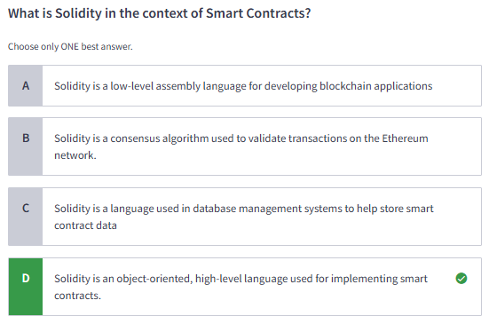
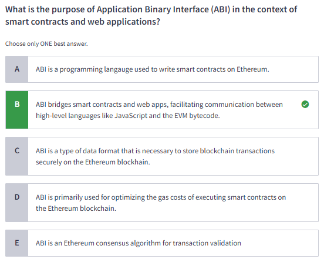
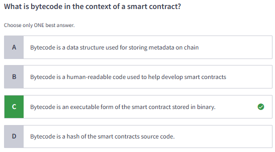
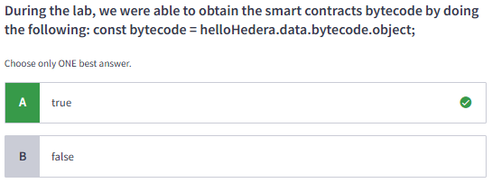
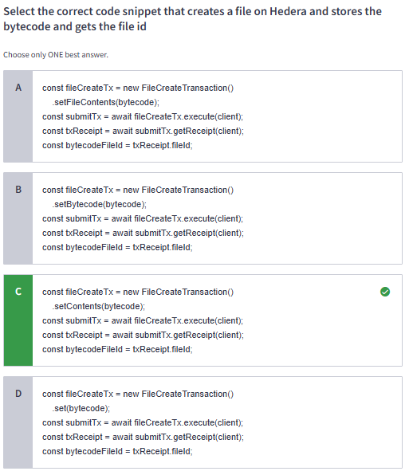
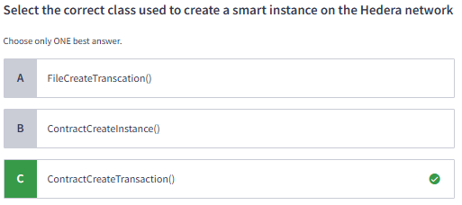
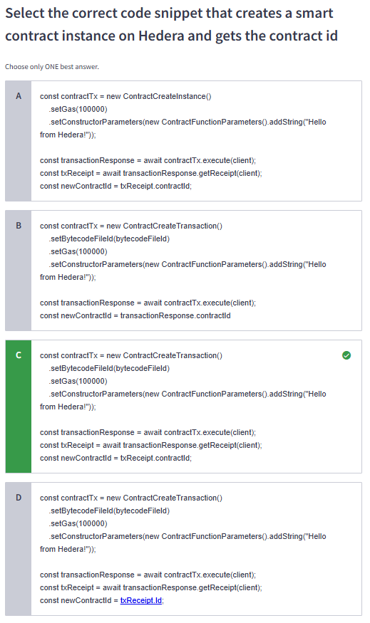
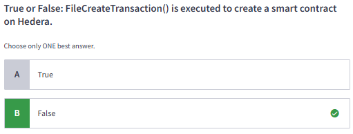
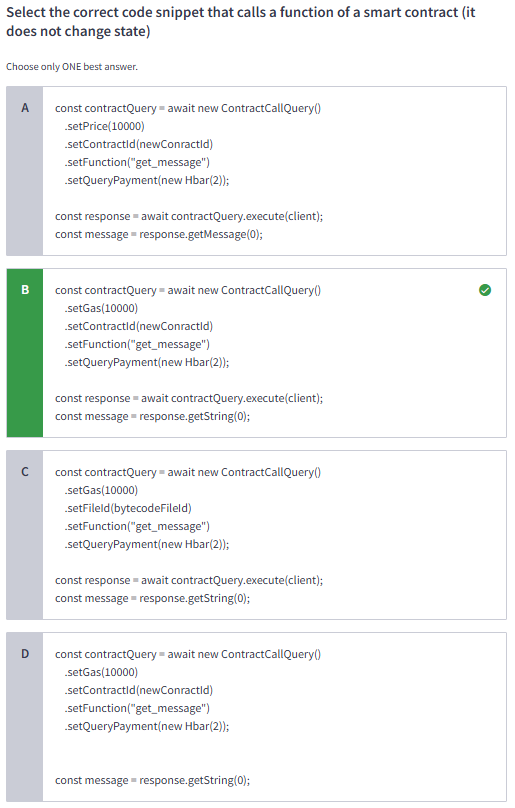
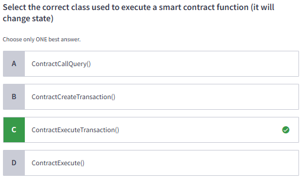
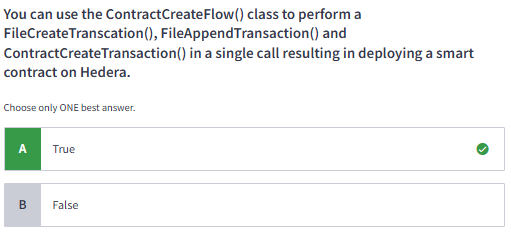
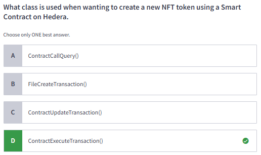
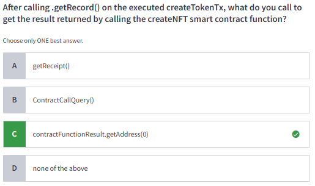