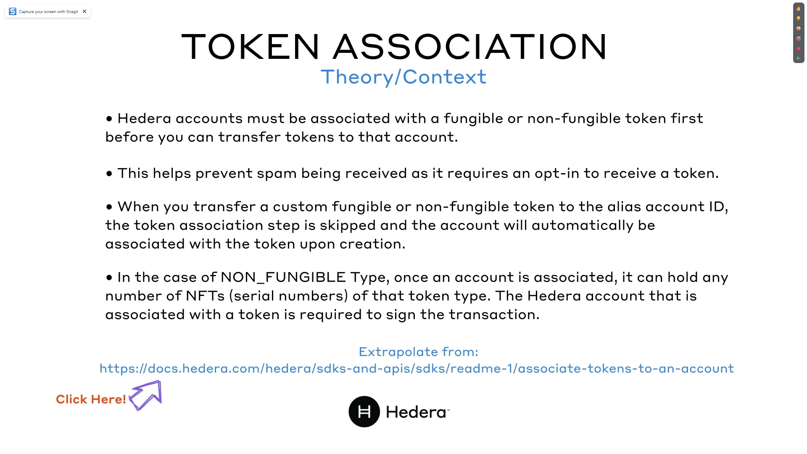
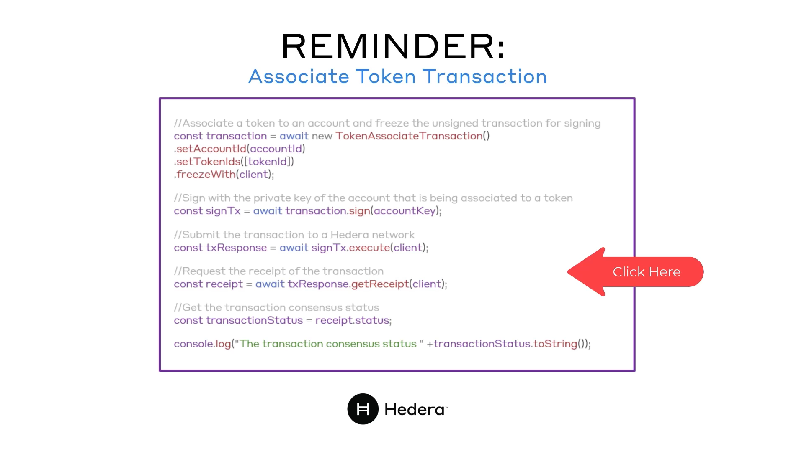
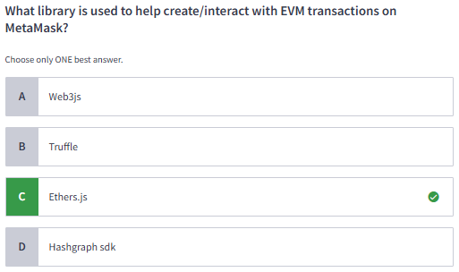
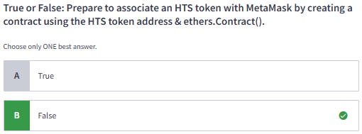
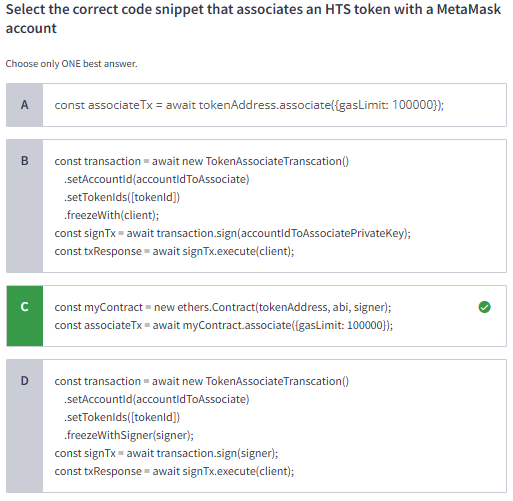
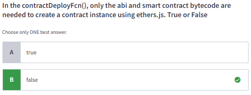
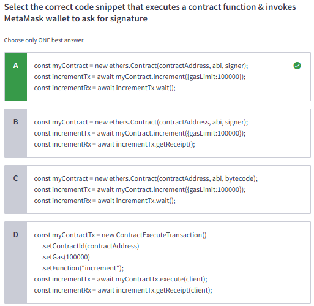
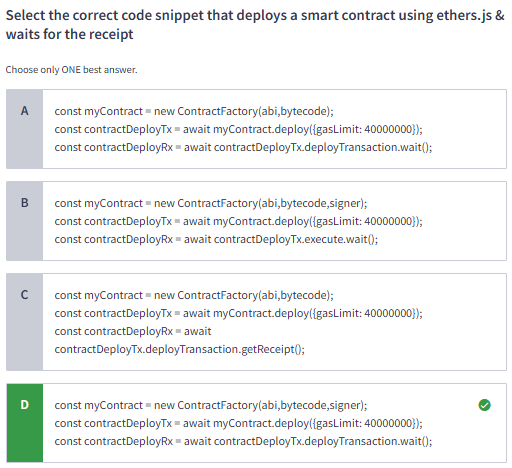
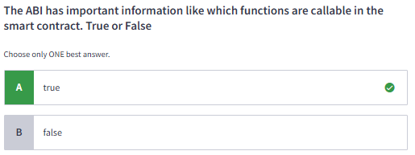
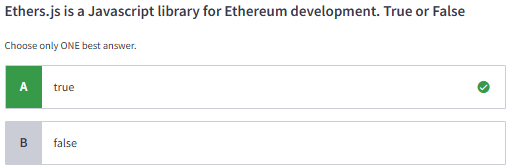

#### Certified Hedera Developer | M11: Interoperability

# 11.1 Token Association

# 11.2 Lab 11A: Token Associator Using Metamask
[Github Metamask Token Associator](https://github.com/hedera-dev/tutorial-js-metamask-token-associator)

# 11.3 Lab 11B: How to Create a Smart Contract App on Hedera Using Solidity, React JS, MetaMask, and Ether JS - A Simple Counter - Getter/Setter (Parts inventory) with MetaMask
[Hedera Block](https://hedera.com/blog/how-to-create-a-smart-contract-app-on-hedera-using-solidity-react-js-metamask-and-ethers-js-a-simple-counter)

# 11.4 Quiz

